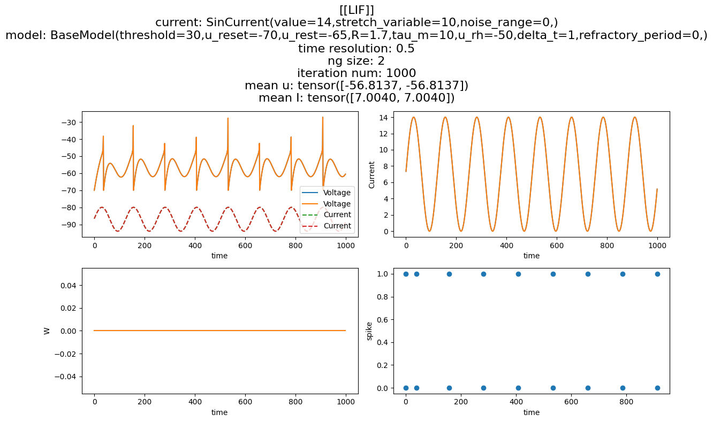

# LIF Family Implementation

## Overview

In this project, we aimed to implement three basic and important neuron models using PyMontorch library, which is developed specifically for CNS (Computational NeuroScience).

**Models:**

- LIF (Leaky Integrate-and-Fire)
- ELIF (Exponential Leaky Integrate-and-Fire)
- AELIF (Adaptive Exponential Leaky Integrate-and-Fire)

## Base Model

A based model is used to implement all 3 models which you can find it `model.py`.

## LIF (Leaky Integrate-and-Fire) Model

The LIF model is one of the simplest and most widely used models of spiking neurons. It approximates the behavior of real neurons by considering the membrane potential dynamics and a threshold mechanism for spike generation.

### Model Equation

The membrane potential $u(t)$ is governed by the following differential equation:

$\tau*m \frac{du(t)}{dt} = - (u(t) - u*{rest}) + R \cdot I(t)$

Where:

- $\tau_m$ is the membrane time constant
- $u\_{rest}$ is the resting membrane potential
- $R$ is the membrane resistance
- $I(t)$ is the input current

### Spike Generation

A spike is generated when $u(t)$ reaches a threshold $u_{th}$. After the spike, $u(t)$ is reset to a reset potential $u_{reset}$.

### Implementation

The implementation of the LIF model in PyMontorch involves defining the membrane potential dynamics and the spike generation mechanism which is observable in `model.py`.

### Result

## ELIF (Exponential Leaky Integrate-and-Fire) Model

The ELIF model extends the LIF model by adding an exponential term to the membrane potential dynamics, which accounts for the sharp increase in potential near the threshold.

### Model Equation

$\tau*m \frac{du(t)}{dt} = - (u(t) - u_{rest}) + \Delta*T \exp\left(\frac{u(t) - u_{th}}{\Delta_T}\right) + R \cdot I(t)$

Where:

- $\Delta_T$ is the slope factor
- Other variables are as defined in the LIF model

### Implementation

The implementation is observable in `model.py`.

### Results

## AELIF (Adaptive Exponential Leaky Integrate-and-Fire) Model

The AELIF model further extends the ELIF model by introducing an adaptation mechanism, which adjusts the threshold based on the neuron’s spiking history.

### Model Equation

The membrane potential dynamics are given by:
$\tau*m \frac{du(t)}{dt} = - (u(t) - u_{rest}) + \Delta*T \exp\left(\frac{u(t) - u_{th}}{\Delta*T}\right) + R \cdot I(t) - w(t)\tau*w \frac{dw(t)}{dt} = a(u(t) - u_{rest}) - w(t)$

Where:

- $w(t)$ is the adaptation variable
- $\tau_w$ is the adaptation time constant
- $a$ is the sub-threshold adaptation parameter
- Other variables are as defined in the ELIF model

### Spike Generation and Adaptation

When a spike is generated, $w(t)$ is incremented by a constant $b$:
$w(t) \leftarrow w(t) + b$

### Implementation

The implementation is observable in `model.py`.

### Results

## Conclusion

In this project, we successfully implemented the LIF, ELIF, and AELIF neuron models using the PyMontorch library. Each model captures different aspects of neuronal behavior, with increasing complexity and biological realism. These models serve as foundational tools for simulating and understanding neuronal dynamics in computational neuroscience.
